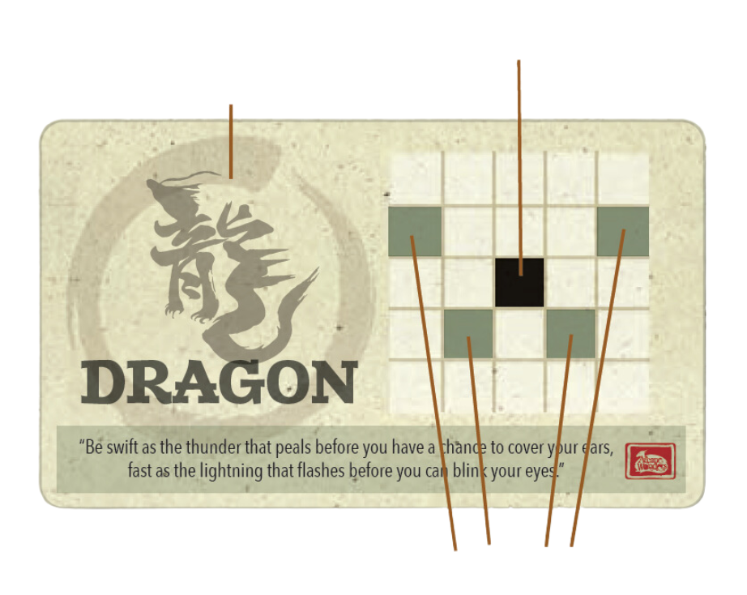

# Onitama Board Game Clone

Welcome to the Onitama board game clone! This project is a web-based implementation of the popular board game Onitama, where players strategically move their pieces to outmaneuver and capture their opponent's master.

It was created using:
- HTML
- CSS
- Javascript

You can find the game here:

### https://shaneedw7.github.io/Onitama-Clone/

## Table of Contents

- [Introduction](#introduction)
- [Features](#features)
- [Usage](#usage)
- [Game Rules](#game-rules)
- [Acknowledgments](#acknowledgments)

## Introduction

This project is a JavaScript implementation of the Onitama board game. The game allows two players to engage in a strategic battle on a 5x5 grid, using movement cards that determine the available moves for their pieces. The game features a user-friendly interface and provides helpful strategy tips to enhance the gaming experience.

## Motivation

As a board game fan I planned this project, thinking it would be challenging but achievable as a software devlopment student. I had decided that because the game already had a specific set of rules that I already had a good roadmap on how the project would progres. Little did I know, it was a very complex project requiring a deep understanding of Javascript. It tested my problem solving as I grappled with asynchronous programming, understanding 'this', refactoring, and object oriented programming.

## Features

### - Responsive UI
- Responsive user interface with dynamic updates based on game events.
- Players can click on pieces and movement cards to make their moves, with visual cues highlighting valid moves and selected pieces.
- The game has a responsive design, allowing players to enjoy it on various devices.

### - Strategy Toasts
- Display strategy toasts with tips on gameplay strategies.
- Tips include advice on piece movement, card selection, and overall gameplay strategy.

### - Dynamic Toast Display
- Toggle the display of strategy toasts with a button click.
- Toasts appear randomly and at regular intervals for ongoing guidance.

### - Game Initialization
- Set up the game with two players, each having a master and student pieces.
- Initialize the game board, piece positions, and card selections.
- Initialize player settings, including color, selected cards, and game mode.
 
### - Local Storage
- Store and retrieve player settings, including color and game mode, using local storage.

### - AI Player
- A basic AI player that randomly selects cards and makes legal moves.
- AI player functionality includes automatic card selection and piece movement.

### - Game Board Interaction
- Click on pieces to select them for movement.
- Highlight valid moves on the board based on selected cards and piece positions.

### - Piece Movement
- Animate piece movement on the board from the current position to the selected position.
- Validate and execute legal moves based on selected cards and board state.

### - Game Over Conditions
- Detect game over conditions, such as capturing the opponent's master.
- Display a modal alert with the winner and an option to start a new game.

### - User Alerts
- Display alerts for various game events, including invalid moves and the need to pass.

### - Continuous Gameplay
- Enable continuous gameplay with automatic switching between players and bot turns.

## Usage

To play the game, simply open the HTML file in a web browser. The game supports two players, and optional AI opponents can be selected. Players take turns selecting movement cards and making moves on the board. The game ends when one player's master is captured or when you or the opponent moves thier master into your temple arch space.

## Game Rules

### Setup

- Choose a color and receive 1 Master and 4 Students.
- The Master pawn is placed on the temple arch nearest you and the 4 Student pawns on the squares on either side of the Master.
- Each player is given 2 random move cards face up as their "hand."
- One additional move card is revealed and placed on the right side of the game play area to determine the starting player.
- The stamp in the lower right-hand corner of the card is used to decide the starting player.
- The rest of the move cards will not be used.

### How to Play

Combat in Onitama is simple and elegant, involving the following steps:

1. **Move and Attack:**
   - On your turn, choose one of the two Move cards in front of you.
   - Click on a pawn (student or master) to move according to the chosen card.
   - Your pawn can move to any indicated space as highlighted on the grid relative to its starting position.
   - Capturing an opponent's pawn is achieved by landing on its square.

2. **Exchange Cards:**
   - The used Move card is replaced with the card on the side of the playmat.
   - The replaced card is added to your hand, and you may use it in your next turn.

Continue taking turns until one player achieves mastery of their Martial Art.

### How to Win

There are two ways to win:

1. **Way of the Stone:**
   - Capture your opponent's Master pawn.

2. **Way of the Stream:**
   - Move your own Master pawn into your opponent's Temple Arch space.

### What if I don't want to move?

If you have a legal move, you must take it. If you cannot make a legal move, pass your turn. Choose one of the two cards in front of you to be placed on the side of the play area and receive the card from the right of the play area.

## Acknowledgments

This project was inspired by the Onitama board game. Special thanks to the creators of Onitama for the original game concept.

I extend a heartfelt thanks to my mentor, Joel Lake, for his invaluable guidance throughout this project. Joel not only navigated around my busy schedule but also fueled my project ambitions with unwavering support.

Enjoy playing Onitama, and may the best strategist win!
